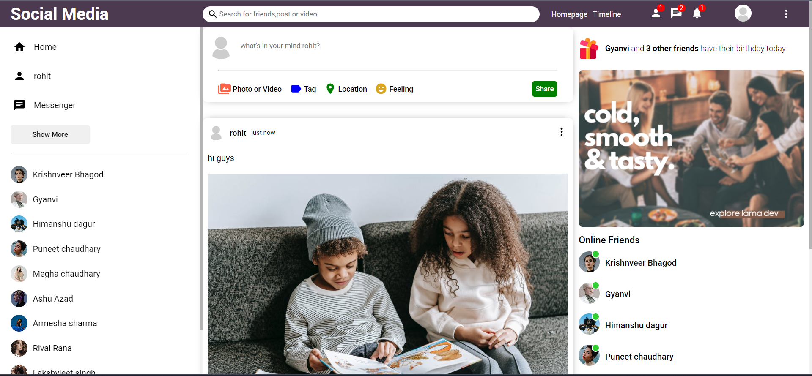

# Social Media App - Project Overview

## Project Introduction
The Social Media App is a web application that allows users to connect with friends, share posts, send messages, and explore a personalized feed. The app aims to provide a seamless and engaging social media experience to its users.

## Features Developed
1. User Authentication: Users can register, log in, and maintain secure accounts with hashed passwords using bcrypt.
2. Post Creation: Users can create and share posts with images.
3. News Feed: Users have access to a personalized news feed with posts from their friends and people they follow.
4. Messaging: Users can send and receive messages in real-time using Socket.IO.
5. User Profile: Each user has a profile page displaying their posts, followers, and following.
6. Image Upload: Users can upload profile pictures and post images using Multer for file handling.
7. Conversation Management: Users can have private conversations with other users.
8. Security: The app implements security measures using Helmet to protect against common web vulnerabilities.
9. Real-time Notifications: Users receive real-time notifications for new messages and follow requests.
10. Responsive UI: The front-end is designed with Material-UI, making it mobile-friendly and responsive.

## Technologies Used
### Backend
- Node.js: Server-side JavaScript runtime.
- Express.js: Web application framework for creating RESTful APIs.
- MongoDB: NoSQL database for data storage.
- Mongoose: MongoDB object modeling for Node.js.
- Socket.IO: Real-time bidirectional event-based communication.
- Multer: Middleware for handling file uploads.
- Helmet: Middleware for securing HTTP headers.
- Nodemon: Utility for automatic server restart on code changes.
- dotenv: Library for handling environment variables.

### Frontend
- React.js: Front-end JavaScript library for building UI components.
- Material-UI: UI component library based on Google's Material Design.
- Axios: HTTP client for making API requests.
- React Router: Library for handling client-side routing.
- Socket.IO Client: Client-side library for real-time communication.
- timeago.js: Library for displaying timestamps in a human-readable format.

## Challenges Faced
1. Real-time Communication: Implementing real-time messaging and notifications required careful handling of socket connections and events.
2. Image Upload: Ensuring secure and efficient image upload while managing file storage and retrieval.
3. User Authentication: Designing a robust and secure authentication system to protect user data.
4. Scalability: Ensuring the application can handle increasing user traffic and database growth.
5. Cross-Browser Compatibility: Addressing issues related to browser compatibility during UI development.

## Final Outcome
The Social Media App successfully provides users with an engaging social media experience. Users can create accounts, post content, interact with friends, and communicate through real-time messaging. The application's security features protect user data and ensure a safe online environment. The app's responsive design allows seamless usage across various devices.

## Practical Usage
The Social Media App can be used as a platform for social networking, allowing users to connect with friends, share moments, and stay updated with their social circle. Users can use the app to discover new content, engage with posts, and communicate in real-time. The application's user-friendly interface and responsive design make it accessible on both desktop and mobile devices.
